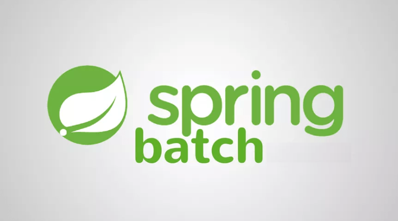

# Spring Batch Tasklet

Esta es una aplicación de ejemplo que utiliza Spring Batch con un enfoque de Tasklet para procesar datos personales. La aplicación recibe un archivo `persons.zip` que contiene un archivo `persons.csv` mediante un método POST a la URL `http://localhost:8080/v1/uploadFile`. Luego, procesa los datos en varios pasos, descomprime el archivo `persons.zip` para obtener `persons.csv` y guarda el archivo resultante en `files/destination`. A continuación, lee el archivo `persons.csv`, extrae los datos, agrega la fecha de procesado y los escribe en una base de datos.

### Requisitos

Para ejecutar esta aplicación, necesitarás tener instalado lo siguiente:

1. Docker
2. Docker Compose

### Ejecución

Para ejecutar la aplicación, sigue estos pasos:

1. Clona el repositorio desde GitHub:

```bash
git clone https://github.com/agcadu/SpringBatch-Tasklet.git
```

2. Ingresa al directorio del proyecto:

```bash
cd SpringBatch
```

3. Ejecuta el comando `docker-compose` para levantar el contenedor de la aplicación y la base de datos:

```bash
docker compose up
```

4. La aplicación estará disponible en `http://localhost:8080/v1/uploadFile` para recibir el archivo `persons.zip`. Puedes utilizar la colección de Postman `AplicationBach.postman_collection` para realizar pruebas.

5. Asegúrate de tener el archivo `persons.csv` que deseas procesar. Puedes utilizar el archivo proporcionado en la carpeta raiz `persons.csv` para pruebas.

### Descripción del Proceso

1. Envía una solicitud POST a `http://localhost:8080/v1/uploadFile` con el archivo `persons.zip`.
2. La aplicación recibirá el archivo, lo guardara en la carpeta `files`, lo descomprimirá y guardará el archivo `persons.csv` en la carpeta `files/destination`.
3. A continuación, leerá el archivo `persons.csv`, extraerá los datos
4. Agregará la fecha de procesado.
5. Los datos procesados se guardarán en una base de datos PostgreSQL que estara disponible en `localhost:5432/batch_database`.

### Estructura del Proyecto

La aplicación está construida con Spring Batch y sigue la estructura básica de un proyecto de Spring Boot. Los archivos y directorios clave son:

- `src/main/java/com/batch`: Contiene el código fuente de la aplicación, incluyendo los pasos de procesamiento.
- `src/main/resources`: Contiene los archivos de configuración de Spring, incluyendo `application.properties`.
- `Dockerfile`: Archivo de Docker para la creación de la imagen de la aplicación.
- `docker-compose.yml`: Archivo de Docker Compose para levantar los contenedores de la aplicación y la base de datos.

### Notas

- Esta aplicación es solo un ejemplo y no debe utilizarse en un entorno de producción sin las adecuadas consideraciones de seguridad y rendimiento.
- Si el contenedor de la aplicación falla al iniciar, asegúrate de que el contenedor de la base de datos se haya iniciado correctamente. Si no es así, intenta reiniciar el contenedor de la aplicación.
- Asegúrate de que los archivos `persons.zip` y `persons.csv` que se envían a la aplicación contengan datos válidos en el formato esperado.
